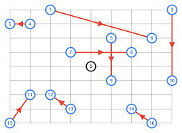
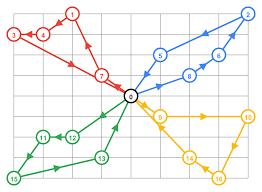
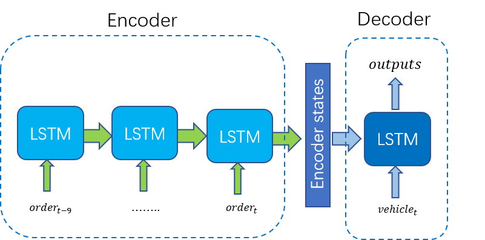

## Introduction
Recent researches revealed that deep reinforcement learning(DRL) has potential to solove optimization problem like travelling salesman problem(TSP)\[[1](https://arxiv.org/pdf/1611.09940.pdf)\] ,vehicle routing problem(VRP) and their variants \[[2](https://papers.nips.cc/paper/8190-reinforcement-learning-for-solving-the-vehicle-routing-problem.pdf)\]\[[3](https://dl.acm.org/doi/pdf/10.1145/3394486.3403356)\]. These problems are NP-hard problems and usually solved using manuscript heuristics. It requires expertise in optimization field to design efficient heuristic algorithms. DRL has shown great potential to automatically learn heuristics, attracting more researchers to apply DRL to solve such problems.

Pick up and delivery problem is such a NP-hard problem. Its goal is to final optimal path to satisfy all demands on a map given a set of origins and destinations and several vehicles with limited capacity. This is illustrated below. One can set time windows for each demands to ensure orders are picked up during specific time windows, which is called pickup and delivery problem with time windows (PDPTW). Since the problem is very common in the reality like food delivery, ride hailing service and other transportatio systems, many literatures focus on developing efficient algotihtms to solve the problem. However, a more realistic setting is that deamnds will appear dynamically, leading to much more sophisticated problems. The dynamic of transition is also hard to be captured using mathematical tools.

  
  

Therefore, more and more researches begin to apply DRL to solve dynamic PPDTW. Amazon sets a reinforcement learning benchmarks for online pick up and delivery problem \[[4](https://arxiv.org/pdf/1911.10641.pdf)\]. Other researches try to deploy DRL agents for ride hailing service\[[5](https://arxiv.org/pdf/1903.03882.pdf)\]\[[6](https://arxiv.org/abs/1911.11260)\]. 

Based these works, the project aims to build a real time on-demand bus service using a single DRL agent. On-demand buses pick up real-time demands at origins and drop off customers at their corresponding destinations. It is basiclly a larger carpolling system with larger capacity and lower price. The system is in between current bus sytems and ride hailing systems, which can effictively reduce the current traffic conjestion caused by surging ride hailling service\[[7](https://arxiv.org/pdf/2003.10942)\]. 

## Methods
In order to build such on-demand bus system, a simulation environment and proper policy network has been proposed, which are illustrated in details in the following parts.

### Environment Setting

#### Basic Setting
To simplfy operation strategies, a 10 by 10 square grids are created to represent different districts. It is also reasonable to do so in reality. For example, we can set a bus station in a 500 meters by 500 meters area, which is reachable by walking. Then, people can gather to bus station and request bus service. Therefore, all demands happen in the center of squared area. One episode has 1000 hundred time steps. In each time step, demands will be generated using poisson distribution with 0.2 arrival rate. Therefore, about 200 orders will be generated in one episode. For space distribution, origins will be generated using normal distribution with mean at the center (5,5) and variance 4. Destinations will be obtained randomly in the sapce. The generated demand will disappear at 0.05 possibility at every step if it hasn't been statisfies for 10 time steps.

In each time step, bus can move 1 unit to its current destination. If bus moves to one station and exceed 1 unit, the bus will stop at the station. If bus stop at one station and its current capacity is less than 5, it will pick up as many customers as possible and also release the in-vehicle customers. The model now doesn't consider service time. 

The below gif can illustrate such procedure.

#### States
In each time step, we have two kind of states. One is customers' information, which incudes their origins, destinations and waiting time. Another is vehicle information. This includes bus location, in-vehicle peoples' destinations and their in-vehicle time. The two kind of states can represent current time step states.

#### Actions
Each time step, the bus agent will decide its destination. In this setting, the possible destinations are 100 districts. However, as demands are dense in this setting. For each time step, bus will decide to move to existing orders' origins, in-vehicle people's destination and stay in place. This will greatly reduce the dimensionality of action space and increase the stability.   

#### Rewards
The rewards design is also simple. The agent will get -1 reward for every time step and get +20 if a customer is delivered successfully. If customers are delivered within 20 time steps, the agent will get bonus +1 for every saved time. If the delivery is beyond 20 time steps, the agent will get punishment -1 for every consumed time steps.

### Network Design 
Another hard part is to design a proper neural network to capture the changing environment. The first problem is that demands appear and disappear dynamically. The input size will change over time. To capture this, a LSTM encoder is used to encode the orders. The network inputs the latest 10 orders and encoder them. Then, a LSTM cell decodes hidden units using the current bus information including bus location, in-vehicle people's destinations and their corresponding in-vehicle time. Also, masks of outputs are adopted to allow possible actions. The design is shown below.

  

## Experiments and results
Two models are proposed to solve the above enviroment setting, which are actor critic using a PPO agent and dueling double deep q network. The parameters of actor critic with a PPO agent are 

| Parameters    | Actor Critic |Dueling Double DQN|
| ------------- | ----------------- |--------|
| Discount | 0.99|0.99|
|Number of episode  | 5000  |5000|
|Batch|/|32|
|Exploration Rate|/|0.01|
|Repaly Memory Size|/|10000|
|Learning Rate|0.0005|0.0005|
|Entropy Regularization|0.005|/|
|Steps to Update Target Networks|/|1000|

## Future Work

## Reference
\[[1](https://arxiv.org/pdf/1611.09940.pdf)\] Bello, I., Pham, H., Le, Q. V., Norouzi, M., & Bengio, S. (2016). Neural combinatorial optimization with reinforcement learning. arXiv preprint arXiv:1611.09940.

\[[2](https://papers.nips.cc/paper/8190-reinforcement-learning-for-solving-the-vehicle-routing-problem.pdf)\]Nazari, M., Oroojlooy, A., Snyder, L., & Takác, M. (2018). Reinforcement learning for solving the vehicle routing problem. In Advances in Neural Information Processing Systems (pp. 9839-9849).

\[[3](https://dl.acm.org/doi/pdf/10.1145/3394486.3403356)\]Efficiently Solving the Practical Vehicle Routing Problem: A Novel Joint Learning Approach

\[[4](https://arxiv.org/pdf/1911.10641.pdf)\]Balaji, B., Bell-Masterson, J., Bilgin, E., Damianou, A., Garcia, P. M., Jain, A., ... & Ye, C. (2019). Orl: Reinforcement learning benchmarks for online stochastic optimization problems. arXiv preprint arXiv:1911.10641.

\[[5](https://arxiv.org/pdf/1903.03882.pdf)\]Al-Abbasi, A. O., Ghosh, A., & Aggarwal, V. (2019). Deeppool: Distributed model-free algorithm for ride-sharing using deep reinforcement learning. IEEE Transactions on Intelligent Transportation Systems, 20(12), 4714-4727.

\[[6](https://arxiv.org/abs/1911.11260)\] Holler, J., Vuorio, R., Qin, Z., Tang, X., Jiao, Y., Jin, T., ... & Ye, J. (2019, November). Deep Reinforcement Learning for Multi-Driver Vehicle Dispatching and Repositioning Problem. In 2019 IEEE International Conference on Data Mining (ICDM) (pp. 1090-1095). IEEE.\

\[[7](https://arxiv.org/pdf/2003.10942)\]Riley, C., Van Hentenryck, P., & Yuan, E. (2020). Real-Time Dispatching of Large-Scale Ride-Sharing Systems: Integrating Optimization, Machine Learning, and Model Predictive Control. arXiv preprint arXiv:2003.10942.
